<p align="center">
  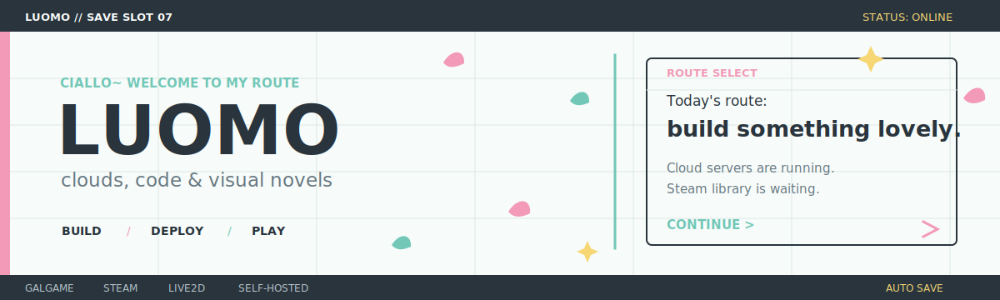
</p>

<p align="center">
  <a href="https://luomo.moe"></a>
  <a href="https://www.march7th.cn"></a>
  <a href="https://status.luomo.moe"></a>
  <a href="https://x.com/luomo712"></a>
</p>


### PLAYER 01 // LUOMO

> **Ciallo~ Welcome to my little universe.**

I build self-hosted tools somewhere between cloud servers, anime playlists, virtual companions, and a Steam library that keeps growing.

写一点代码，养几台服务器，也认真追番和打游戏。喜欢音乐、星空与充满生命力的二次元世界，也喜欢把脑海里的小东西慢慢打磨成真正会长期使用的产品。

```text
class       self-hosted builder
main party  Python / FastAPI / TypeScript / Next.js
signal      anime / music / open worlds / space fantasy
mood        moonlight / star trails / live music / open fields
status      building, watching, exploring
```

<br clear="right" />

<p align="center">
  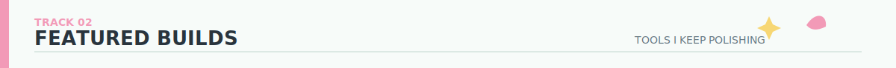
</p>

<p align="center">
  <a href="https://github.com/luomo66ccff/luomo-home">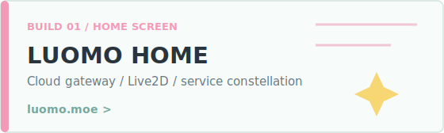</a>
  <a href="https://github.com/luomo66ccff/luomocore">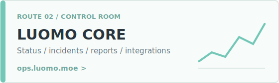</a>
</p>

<p align="center">
  <a href="https://github.com/luomo66ccff/luomoapi-hub">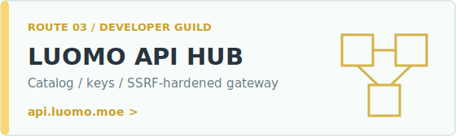</a>
  <a href="https://github.com/luomo66ccff/luomofile-hub">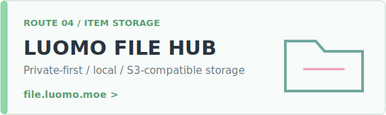</a>
</p>

<p align="center">
  <a href="https://github.com/luomo66ccff/luomoterminal">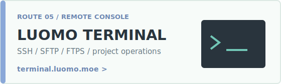</a>
  <a href="https://github.com/luomo66ccff/file-download-proxy">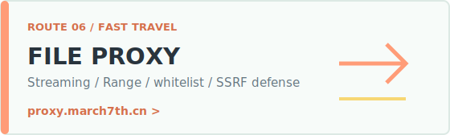</a>
</p>

<details>
  <summary><strong>More things in the workshop</strong></summary>
  <br />

  - [steam-automation-hub](https://github.com/luomo66ccff/steam-automation-hub): read-only ArchiSteamFarm telemetry and automation health.
  - [rogue-snake-server](https://github.com/luomo66ccff/rogue-snake-server): a small standard-library backend for sessions, scores, and leaderboards.
  - [hexo](https://github.com/luomo66ccff/hexo): notes, experiments, and longer stories from the blog.
  - [firefly](https://github.com/luomo66ccff/firefly): an older character-themed web project kept as part of the journey.
</details>

<p align="center">
  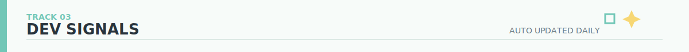
</p>

<p align="center">
  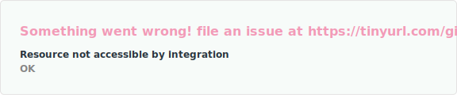
  
</p>

<p align="center">
  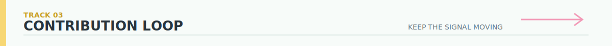
</p>

<picture>
  <source media="(prefers-color-scheme: dark)" srcset="./assets/contribution-snake-dark.svg" />
  <source media="(prefers-color-scheme: light), (prefers-color-scheme: no-preference)" srcset="./assets/contribution-snake.svg" />
  
</picture>

### INVENTORY // TOOLKIT

<p align="center">
  
  
  
  
  
  
  
  
</p>

<p align="center">
  <sub>Today's signal: watch something lovely, then build something useful.</sub>
</p>

<!-- profile-readme: luomo66ccff -->
